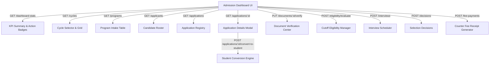

# Phase 4 Implementation Plan: Admission Dashboard UI (Final Converged Plan)

> **Execution Standard**: Planning ONLY. No frontend code modifications, no database edits, no data insertion, and no commits/pushes are performed in this phase.

---

## 1. Executive Summary & Architectural Alignment

The **Phase 4 Admission Dashboard UI** delivers an executive and operational management control room for the college admission lifecycle. It integrates directly into the existing ERP system, reusing established UI component layouts, authentication hooks, and state management conventions.

### Architectural Reuse Matrix
| Requirement Area | Existing ERP Asset / Pattern Reused | Implementation Detail |
| :--- | :--- | :--- |
| **Layout & Shell** | `DashboardLayout`, `Header`, `Sidebar` | Single unified layout; no second navigation frame created. |
| **Routing & Auth** | `ProtectedRoute`, `useAuth` hook | Active JWT authentication, role checks for `Admin`, `Admission Officer`, `Registrar`. |
| **API Communications**| `fetchWithAuth` client utility | Standardized JSON payload transmission, bearer token authorization, global 401 handling. |
| **Design Tokens** | Tailwind CSS theme system | Dark glassmorphism elements, custom gradients, status-keyed badges, accessible contrast. |
| **Feedback System** | `Toast` notifications, `Modal`, `ConfirmationDialog` | Reusable modal dialogs for interactive actions (verification, decisions, conversion). |

---

## 2. Phase 3 API Compatibility Mapping

Every view in the Admission Dashboard UI binds strictly to an existing Phase 3 REST endpoint under `/api/admission`. No un-backed endpoints or mock data structures are introduced.



### Direct Endpoint Mappings
1. **Dashboard Overview**: `GET /api/admission/dashboard-stats`
2. **Admission Cycles**: `GET /api/admission/cycles`, `POST /api/admission/cycles`, `PUT /api/admission/cycles/:id`
3. **Programs & Intake**: `GET /api/admission/programs`, `POST /api/admission/programs`, `PUT /api/admission/programs/:id`
4. **Candidate Profiles**: `GET /api/admission/applicants`, `POST /api/admission/applicants`, `PUT /api/admission/applicants/:id`
5. **Application Registry**: `GET /api/admission/applications`, `POST /api/admission/applications`, `GET /api/admission/applications/:id`, `PUT /api/admission/applications/:id/status`
6. **Document Verification**: `GET /api/admission/documents`, `POST /api/admission/documents`, `PUT /api/admission/documents/:id/verify`
7. **Cutoff Eligibility**: `POST /api/admission/eligibility/evaluate`, `POST /api/admission/eligibility/auto-screen`
8. **Interview Scheduler**: `GET /api/admission/interviews`, `POST /api/admission/interviews`, `PUT /api/admission/interviews/:id`
9. **Selection Decisions**: `GET /api/admission/decisions`, `POST /api/admission/decisions`
10. **Counter Fee Receipts**: `GET /api/admission/fee-payments`, `POST /api/admission/fee-payments`
11. **Student Conversion**: `POST /api/admission/applications/:id/convert-to-student` (Invoked via Application Details Modal)

---

## 3. Zero-Record & White-Page Prevention Strategy

To guarantee that `/admission/dashboard` and `/admissionofficer/dashboard` never render a blank white page or crash when tables contain 0 records or during direct browser refresh:

### Defensive UI Guardrails
1. **Defensive API Data Extraction**:
   ```typescript
   // Guarantees zero-record safety without undefined/null property errors
   const stats = data?.data || {};
   const totalApplications = Number(stats.totalApplications ?? 0);
   const applicationList = Array.isArray(data?.data?.applications) ? data.data.applications : [];
   ```
2. **Empty State UI Components**:
   - When `totalApplications === 0`, render informative callout boxes with action guidance (e.g., "No active admission cycle found. Create an admission cycle to get started.").
   - Tables display standard `<EmptyStateMessage title="No Applications Registered" message="Applications will appear here once candidates register." />`.
3. **Skeleton Loading & Error Boundaries**:
   - Active loading states render glowing skeleton cards instead of blank screens.
   - Uncaught API errors (500, 404, network timeout) render a localized error notification card with a "Retry Connection" button.
4. **Direct Refresh Resilience**:
   - Synchronous token re-validation via `useAuth` hook ensures route state is restored seamlessly without flash-of-unauthenticated-content or route redirection loops.

---

## 4. Workflows & Management Area Specifications

### Area 1: Executive Dashboard & Pending Action Counters
- **KPI Summary Cards**: Total Applications, Pending Verification, Eligible Candidates, Confirmed Admissions, Total Fees Collected.
- **Dynamic Pending Actions Queue**:
  - `Applications Awaiting Review`: Count of `SUBMITTED` applications.
  - `Documents Awaiting Verification`: Count of `PENDING_VERIFICATION` documents.
  - `Interviews Scheduled / Pending Action`: Count of `SCHEDULED` interviews.
  - `Selection Decisions Pending`: Applications with evaluated cutoff score awaiting decision.
  - `Admission Confirmation Pending`: `OFFER_SENT` candidates awaiting fee receipt.

### Area 2: Admission Cycles & Program Intake
- Operational control to create and manage academic cycles (`AY 2026-27 Autumn`) and set program seat targets (`total_seats`).
- Live allocation trackers calculate `remaining_seats = total_seats - allocated_seats`.

### Area 3: Application Registry & Application Details Drawer
- Tabular roster of all submitted applications with quick search by `application_number`, candidate name, or program.
- **Application Details Drawer**:
  - Full candidate bio, entrance marks, document inspection tab, interview logs, decision history, and fee breakdown.

### Area 4: Student Conversion Location (Integrated Workflow)
Student conversion is strictly embedded inside the Application Details drawer when an application reaches `ADMISSION_CONFIRMED` status.

```
Applications Registry 
  └── Select Application Card 
        └── Open Application Details Modal 
              └── Fee Status Verified: PAID 
                    └── Action Button: [Convert to Student]
                          └── Confirmation Modal (Displays Applicant, Application #, Program, Tuition Fee, Paid Amount)
                                └── Execute API: POST /api/admission/applications/:id/convert-to-student
```
- **Confirmation Drawer Data Display**:
  - Applicant Full Name
  - Application Number
  - Enrolled Program & Department
  - Total Tuition Fee vs Paid Amount (Fee Status: `PAID` / `PARTIALLY_PAID`)
  - Confirmation status flag
- **Security & Privacy**:
  - The UI triggers an explicit confirmation dialog.
  - The backend generates and cryptographically hashes the temporary student password.
  - **No temporary password is ever transmitted to or displayed in the UI frontend.**

### Area 5: Document Metadata & Verification Management
- **Explicit Metadata Separation**:
  - Phase 3 backend handles document metadata (`original_filename`, `storage_path`, `mime_type`, `file_size_bytes`, `checksum_sha256`) and verification status (`PENDING_VERIFICATION`, `VERIFIED`, `REJECTED`).
  - The Phase 4 UI renders document metadata attributes, inspection view modal, verification status badges, and action buttons (`Approve Metadata`, `Reject Document`). Binary file storage uploads are handled by the separate storage engine.

---

## 5. Lifecycle Status Display & Separation

Application status and fee payment status are maintained as separate, independent visual indicators.

```
APPLICATION STATUS LIFECYCLE:
DRAFT ──► SUBMITTED ──► UNDER_REVIEW ──► SELECTED / WAITLISTED / REJECTED ──► OFFER_SENT ──► ADMISSION_CONFIRMED ──► CONVERTED_TO_STUDENT
```

```
FEE PAYMENT STATUS LIFECYCLE:
FEE_PENDING ──────────────────────────► PARTIALLY_PAID ──────────────────────────► PAID
```

> **Strict UI Formatting Rule**: `FEE_PENDING` is NEVER rendered in the application status column. Application status badges use distinct theme colors (e.g., Amber for `UNDER_REVIEW`, Emerald for `OFFER_SENT`, Indigo for `CONVERTED_TO_STUDENT`).

---

## 6. Security, RBAC & Responsive Layout

### Security Controls
- **Route Authorization**: `/admission/dashboard` and `/admissionofficer/dashboard` are wrapped in `<ProtectedRoute allowedRoles={['Admin', 'Admission Officer', 'Registrar', 'Chancellor', 'Vice Chancellor']}>`.
- **JWT Header Injection**: All API interactions pass standard bearer tokens.
- **Sensitive Data Masking**: No raw passwords or user seed secrets are rendered in component states or DOM nodes.

### Responsive Design Specification
- **Desktop / Laptop (≥ 1024px)**: Full multi-column dashboard with side-by-side KPI cards, split-pane application drawer, and sticky table header action bars.
- **Tablet / Mobile (< 1024px)**:
  - Sidebar toggles into an overlay drawer.
  - KPI cards stack vertically into a 2-column or 1-column layout.
  - Data tables transform into responsive card listings with horizontal touch scrolling enabled for multi-column comparison tables.
  - Essential actions (Status update, Verification toggle, Conversion trigger) remain fully accessible on mobile interfaces.

---

## 7. Frontend Verification Test Matrix

Before declaring Phase 4 complete, the following 24 test cases must pass:

| # | Test Scenario | Execution Description | Target Result |
| :-: | :--- | :--- | :--- |
| **1** | Zero-Record Dashboard | Load `/admission/dashboard` with 0 records in database | KPI cards show 0, empty states render cleanly, zero errors |
| **2** | Direct Dashboard Refresh | Press F5 / hard refresh on `/admission/dashboard` | Route re-hydrates cleanly without white screen or 401 redirect |
| **3** | KPI Summary Rendering | Fetch dashboard stats with populated data | Cards display exact counts returned by `GET /dashboard-stats` |
| **4** | Empty State Callouts | View registry tab on fresh installation | Custom `<EmptyStateMessage />` displayed with onboarding callout |
| **5** | Loading States | Slow network throttle on API calls | Skeleton loader pulses smoothly; layout remains stable |
| **6** | API Error Handling | Simulate 500 server response | Local error banner rendered; page does not crash |
| **7** | 401 Unauthorized Test | Expired or missing JWT token | Graceful redirection to `/login` |
| **8** | 403 Forbidden Test | Access dashboard using Student role credentials | Access Denied view displayed cleanly |
| **9** | Recent Applications Roster | View main registry table | Displays application number, applicant name, program, and status |
| **10**| Application Details Drawer | Click application row | Slide-over drawer opens displaying complete application detail payload |
| **11**| Application Status Change | Transition status `SUBMITTED` -> `UNDER_REVIEW` | Badge updates immediately; toast notification confirms update |
| **12**| Fee Status Separation | View application with pending payment | Application status shows `UNDER_REVIEW`; Fee status shows `FEE_PENDING` |
| **13**| Document Metadata Display | View applicant documents tab | Displays filename, size, mime type, checksum, and status badge |
| **14**| Document Verification Action| Click `Approve Metadata` on document | Status badge switches to `VERIFIED`; count updates dynamically |
| **15**| Cutoff Eligibility Evaluation| Run auto-screening rule | Eligible applications flagged green; cutoff score calculated |
| **16**| Interview Scheduler Form | Schedule candidate interview | API payload sent; interview record appears in interview list |
| **17**| Selection Decision Submit | Record `SELECTED` decision | Application status updates to `SELECTED`; offer generation unlocked |
| **18**| Counter Fee Receipt Submit | Log offline cash/DD payment | Fee payment record created; fee status updates to `PAID` |
| **19**| Conversion Drawer Access | Open details for `ADMISSION_CONFIRMED` application | `Convert to Student` button is visible and active |
| **20**| Conversion Confirmation | Click `Convert to Student` button | Confirmation modal displays student summary & warnings |
| **21**| Conversion Execution | Submit student conversion | API executes cleanly; application transitions to `CONVERTED_TO_STUDENT` |
| **22**| Mobile Responsive Check | View dashboard at 375px mobile breakpoint | Navigation drawer works; tables render as mobile cards |
| **23**| Console Error Audit | Open Browser Developer Tools console | Zero uncaught exceptions, zero React key warnings |
| **24**| Production Build Validation | Execute `npm run build` in root workspace | TypeScript compiler & Vite bundler pass with 0 build errors |

---

## 8. Summary of Non-Modifications (Plan Integrity Guarantee)

- **Source Code**: No `.tsx`, `.ts`, `.js`, or `.css` files modified during this planning step.
- **Database**: No schema changes, table alterations, or SQL queries executed.
- **Data Insertion**: Zero fake or test records inserted into the database.
- **Git Repository**: No `git commit` or `git push` executed.

*This plan is fully converged and ready for execution upon authorization.*
